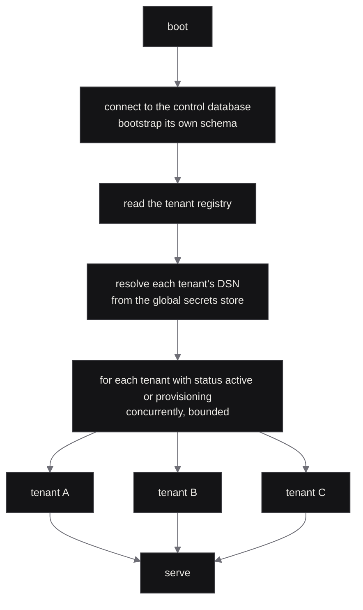

# Boot-time reconciliation

Design for issue #29; the runner is #30. Reconciliation is the one
operation that touches **every tenant database on every boot of every
replica**, so its order, locking and failure behaviour are settled here
rather than discovered in production.

Context: ADR [0008](adr/0008-native-runtime-is-multi-tenant-database-per-tenant.md)
(one database per tenant, a separate control database, two-tier
secrets) and ARCHITECTURE [§7](ARCHITECTURE.md). This applies to the
**native** runtime only. The Cloudflare path has one venture per Worker
and one D1, and applies migrations through `fz migrations apply`.

> **Status: proposed.** Not signed off. The acceptance for #29 asks a
> second engineer to walk each sequence below and answer the three
> questions in [§9](#9-review-questions) without looking. Record the
> sign-off here when that happens.

## 1. What already exists

The pieces this design assembles are shipped, not hypothetical:

- Each module carries its migrations embedded (`include_str!`), keyed
  `<module>/<id>`, ordered by a zero-padded id.
- Both engines record applied migrations in `harness_migrations(id,
  applied_at, checksum)` and **refuse a migration whose recorded sha256
  differs** from the embedded SQL. That is the checksum rule below, and
  it is enforced today.
- Each migration runs in its own transaction with its tracking row
  written in the same transaction.

Two pieces are missing and are the only trait changes this design needs
(narrower than #26 as filed; see the note on that issue): a module's
`depends_on`, and a per-migration `transactional` flag.

## 2. Order



Within one tenant, in order: take the advisory lock, bootstrap that
database's `harness_migrations`, then for each module in `depends_on`
order apply its **base** layer, then its **extension** layer (#31).
Tenants never wait on each other; parallelism is bounded by
configuration, defaulting to something small like 8 so a hundred tenants
do not open a hundred connections at once.

`depends_on` gives a partial order over modules. A cycle is a build
error, not a boot error: `Harness::build` already validates the module
set and is the right place for it.

## 3. Locking

Two replicas booting at once must not both apply the same migration.

**A `pg_advisory_xact_lock` taken inside each tenant's own database**,
keyed on a hash of the tenant id, held for the duration of that tenant's
reconciliation transaction. The lock is taken **before** the "what is
missing" query, never after: reading first and locking second is exactly
the race this prevents.

The lock lives in the tenant database rather than the control database
for two reasons. A tenant's reconciliation must not be able to block
another tenant's, and a control database that is briefly unreachable
must not stop a tenant that is already connected. Advisory transaction
locks are released automatically when the transaction ends, including on
a crash, so a replica that dies holding one does not wedge the fleet.

```mermaid
%%{init: {"theme":"base","themeVariables":{
  "background":"transparent",
  "fontFamily":"ui-monospace, SFMono-Regular, Menlo, monospace",
  "fontSize":"13px",
  "primaryColor":"#141416","primaryTextColor":"#EDEBE6","primaryBorderColor":"#3A3A3F",
  "lineColor":"#6E6E76","textColor":"#8A8A8E",
  "actorBkg":"#141416","actorTextColor":"#EDEBE6","actorBorder":"#3A3A3F",
  "signalColor":"#6E6E76","signalTextColor":"#8A8A8E",
  "noteBkgColor":"#141416","noteTextColor":"#8A8A8E","noteBorderColor":"#3A3A3F"
}} }%%
sequenceDiagram
  participant R1 as replica 1
  participant R2 as replica 2
  participant DB as tenant database
  R1->>DB: BEGIN; pg_advisory_xact_lock(tenant)
  R2->>DB: BEGIN; pg_advisory_xact_lock(tenant)
  Note over R2,DB: blocks
  R1->>DB: read harness_migrations
  R1->>DB: apply 0003, insert tracking row
  R1->>DB: COMMIT (lock released)
  DB-->>R2: lock acquired
  R2->>DB: read harness_migrations
  Note over R2: 0003 already recorded, checksum matches
  R2->>DB: COMMIT, nothing applied
```

## 4. Atomicity

A transactional migration and its tracking row are written in **one
transaction**. Either both happened or neither did; a crash leaves no
half state. This is how both adapters already work.

A migration marked `transactional: false` — the statements Postgres
refuses inside a transaction, `CREATE INDEX CONCURRENTLY` being the one
that will actually come up — cannot be atomic with its tracking row.
Sequence: run the statement alone, then write the tracking row.

**If the process dies between the two**, the next boot sees the
migration as unapplied and runs it again. That is the whole cost, and
the rule that follows is not optional: **a non-transactional migration
must be idempotent** (`CREATE INDEX CONCURRENTLY IF NOT EXISTS`), and
the reconciler refuses to apply one that has no `IF NOT EXISTS` or
equivalent guard, the way the portable-SQL lint already refuses banned
tokens. A crash mid-`CREATE INDEX CONCURRENTLY` also leaves Postgres
with an invalid index, which the retry must drop before recreating; the
runner does that explicitly rather than hoping.

## 5. Checksums

A recorded checksum that differs from the embedded one is **fatal for
that tenant** and is never auto-repaired. Already enforced by both
adapters. The reconciler adds only the fleet behaviour: that tenant goes
`degraded`, the rest continue.

The message names the migration and both hashes, because the operator's
next question is always "which one, and what did it used to be". Rows
recorded before checksums existed are `NULL` and read as "applied,
unverifiable"; they are not treated as mismatches and are not
backfilled, because a backfill would assert something nobody measured.

## 6. Failure

| What failed | What happens |
| :--- | :--- |
| Control database unreachable or its bootstrap fails | Boot aborts, process exits non-zero. There is nothing useful to serve: no registry, no DSNs. |
| One tenant's database unreachable | That tenant is marked `degraded` in the registry, logged, alarmed, and retried on a timer. Every other tenant serves. |
| One tenant's migration fails | Same: `degraded`, with the failing migration id and the database error logged. Never retried automatically in the same boot. |
| Checksum mismatch | Same, and never auto-repaired (§5). |
| `strict` mode | Any of the above aborts boot. For single-tenant deployments and development, where a degraded tenant is just a confusing way to say "broken". |

Requests for a `degraded` tenant answer `503` with problem type
`tenant-degraded`; requests for a tenant not in the registry answer
`404` with `unknown-tenant`. Both are in the error registry so
`docs/ERRORS.md` regenerates.

The registry write is the only thing reconciliation writes to the
control database, and it is best-effort: a tenant that cannot be marked
`degraded` because the control database went away mid-boot is still
refused at request time, because the pool for it was never registered.

```mermaid
%%{init: {"theme":"base","themeVariables":{
  "background":"transparent",
  "fontFamily":"ui-monospace, SFMono-Regular, Menlo, monospace",
  "fontSize":"13px",
  "primaryColor":"#141416","primaryTextColor":"#EDEBE6","primaryBorderColor":"#3A3A3F",
  "lineColor":"#6E6E76","textColor":"#8A8A8E",
  "actorBkg":"#141416","actorTextColor":"#EDEBE6","actorBorder":"#3A3A3F",
  "signalColor":"#6E6E76","signalTextColor":"#8A8A8E",
  "noteBkgColor":"#141416","noteTextColor":"#8A8A8E","noteBorderColor":"#3A3A3F"
}} }%%
sequenceDiagram
  participant B as boot
  participant A as tenant A
  participant C as tenant C (unreachable)
  participant REG as registry
  B->>A: reconcile
  A-->>B: ok, 2 migrations applied
  B->>C: connect
  C-->>B: connection refused
  B->>REG: mark C degraded
  B->>B: serve A and B; retry C on a timer
```

## 7. Observability

- One structured line per **applied** migration: tenant, module,
  migration id, duration. Not one per skipped migration; a fleet of a
  hundred tenants would drown the log on every boot.
- One summary line per tenant: counts applied and skipped, total
  duration, final status.
- A gauge of tenants by status (`active`, `provisioning`, `degraded`),
  which is the thing to alarm on.
- A histogram of per-tenant reconciliation duration, so the boot cost of
  the fleet is visible before it becomes a deploy problem.

No DSN, no secret, and no migration SQL appears in any of it. The
redaction rules in `factory0_core::logging` already apply.

## 8. Dry run

`harness migrate --plan [--tenant <id>]` prints what would be applied,
per tenant and per module, and exits without applying. It takes the same
locks so its answer is not a guess about a moving target, and it is the
thing to run before a deploy that carries migrations.

## 9. Review questions

The three a reviewer should be able to answer from this document,
without looking:

1. **Two replicas boot at once.** Both take a `pg_advisory_xact_lock`
   inside the tenant's own database before reading what is missing; the
   second blocks, then finds the migration recorded with a matching
   checksum and applies nothing (§3).
2. **A `no-transaction` migration's process dies after the DDL.** The
   tracking row was not written, so the next boot re-runs it. That is
   why such migrations must be idempotent, and why the runner drops an
   invalid index before recreating one (§4).
3. **A tenant database is unreachable.** That tenant is marked
   `degraded` and retried on a timer; every other tenant serves;
   requests for it answer `503 tenant-degraded`. Only a control-database
   failure aborts boot (§6).

## 10. Open questions

| Question | Owner | Note |
| :--- | :--- | :--- |
| Default parallelism, and whether it should scale with pool limits | #30 | 8 is a guess. Measure at the tenant count that exists. |
| Retry cadence for a `degraded` tenant, and when it stops retrying | #30 | Needs to not hammer a database that is down for hours. |
| Whether `--plan` should also verify checksums across the fleet without applying | #30 | Cheap, and it turns a deploy-time failure into a pre-deploy one. |
| Where tenant **extension** migrations are stored and versioned | #31 | This document assumes "base then extension" and nothing more. |
| Rollback and recovery for forward-only migrations | #35 | Deliberately out of scope here. |
