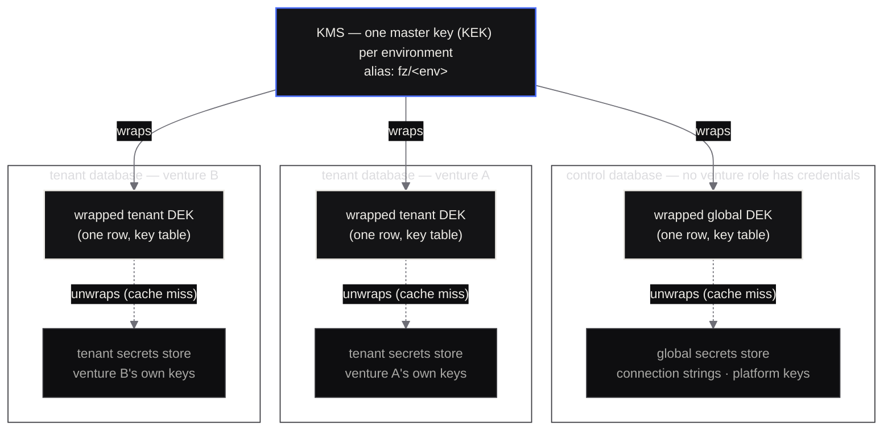

# Secrets: envelope encryption design

Status: proposed, 2026-09-06 · Issue #37 (epic #24) · Binds ADR 0008.
The cipher implementation is chosen by the #38 spike in
[ADR 0102](adr/0102-crypto-crate.md). The storage schema and the `Secrets`
API are #39; KMS providers are #40. Nothing here ships code.

## 1. What is already decided

ADR 0008 fixes three things this document builds on and cannot revisit:

1. **One database per tenant.** The tenant's secrets, its migration
   history and its audit log live inside the tenant's own database, so a
   tenant backs up, restores, moves and drops as one unit.
2. **A separate control database**, with credentials no venture role
   holds, keeps the tenant registry and the **global secrets store**.
3. **Two-tier secrets.** Global secrets (tenant connection strings,
   platform keys) in the control database; tenant secrets in the tenant's
   database. Modules can only ever obtain a tenant store; the global store
   is unreachable from module code — by API *and* by credentials, so the
   separation is physical, not a rule in our own code.

This applies to the native runtime (phase 3). The Cloudflare Worker path
is unchanged: one Worker, one D1, secrets arrive as wrangler environment
bindings exactly as today (section 9).

## 2. Key hierarchy



- **KEK: one master key per environment** (`dev`, `staging`, `prod`), held
  by the KMS, never exportable. Every store's DEK in that environment is
  wrapped by the environment's KEK. A KEK never leaves the KMS; the KMS
  performs wrap and unwrap operations on it.
- **DEK: one 256-bit data key per store**, generated locally from the OS
  RNG, wrapped by the KMS at creation, **stored wrapped inside the
  database that the DEK protects**. The global store has one; every tenant
  store has its own. Key ids (`key_id`) are ULIDs.
- **Per-store keys mean**: offboarding a tenant is a crypto-shred — delete
  the wrapped DEK row (or the whole database) and every ciphertext of that
  tenant is permanently undecryptable; a leaked tenant DEK exposes one
  tenant and no global secret; a tenant's backup is self-contained, and a
  tenant moved to another cluster takes its keys with its data.
- **Rotation is cheap at both levels.** Rotating the KEK re-wraps each
  DEK (one KMS call per store; no secret is re-encrypted). Rotating a
  DEK creates a new `key_id`, re-encrypts that store's secret versions
  under it, and retires the old row after a grace period.

## 3. The database, not the KMS, holds the wrapped keys

Stated explicitly because it is the counter-intuitive half of envelope
encryption: **each database stores the wrapped DEK for the store inside
it** (a small key table: `key_id`, `wrapped_dek`, `kek_id`, cipher,
`created_at`), and the KMS holds no per-store state at all.

This is safe because the wrapped DEK is useless without the KMS: it is an
AEAD ciphertext under the KEK, and the KEK is non-exportable. A full
database dump therefore yields ciphertexts plus a blob that cannot be
unwrapped anywhere but the KMS. It is also what makes the properties in
§2 hold — a backup is self-contained, a tenant move carries its keys, an
offboarding shred is a local delete. If instead the KMS held the wrapped
keys, a database dump would still be useless, but offboarding would
require an out-of-band KMS operation, backups would need key export
coordination, and the KMS would become a per-tenant state store.

## 4. Cipher and nonce policy

The AEAD is **XChaCha20-Poly1305**, chosen by the #38 spike (ADR 0102):
it is the only candidate that builds for `wasm32-unknown-unknown`, keeps
keys zeroised, exposes AAD cleanly, adds ~46 KiB of binary, and needs no C
toolchain. The alternative profile (AES-256-GCM, a FIPS-validated backend
if a contractual FIPS requirement ever lands) is a backend swap at the
port seam, not a redesign.

**Nonce: 24 random bytes from the OS RNG per encryption** (per secret
version). No counters, no persistence, safe across processes: with a
192-bit nonce the birthday collision probability under one DEK is ≈ 2⁻¹²⁹
at 2³² encryptions — and a store performs encryptions only when secrets
are written or rotated, so the real count is tiny.

**The cipher is pinned per key id.** The DEK row records the cipher it
seals with. A backend change (the FIPS path above) provisions a new DEK
version under the new cipher and re-encrypts on rotation; a store never
mixes ciphers within one `key_id`. If AES-256-GCM is ever pinned for a
store, its nonce policy is 12 random bytes with a hard ceiling of 2²⁰
encryptions per DEK (rotating well before the 96-bit birthday bound
matters under a per-store key).

## 5. What binds a ciphertext to its context

Every ciphertext is sealed with additional authenticated data derived
from the row's identity — the detail home-grown schemes skip. The AAD is:

```
FZ-SECRETS-AAD-v1
  || len_le(store_id)   || store_id       // "global" | tenant ULID
  || len_le(secret_name) || secret_name   // "resend/api_key", …
  || len_le(u32)         || version_le    // secret version, monotonically increasing
  || len_le(key_id)      || key_id        // DEK that sealed this version
```

Length prefixes make the encoding injective — no two distinct contexts
share an AAD whatever the character sets. The same bytes are recomputed
on decrypt from the row the caller read. The spike proves each failure
mode against every candidate (`spikes/crypto/tests/roundtrip.rs`):

| Attack | Without AAD binding | With this AAD |
|---|---|---|
| Row copied tenant → tenant | decrypts (if DEK reachable) | **fails**: `store_id` mismatch |
| Row copied tenant → global store | decrypts | **fails**: `store_id` mismatch |
| Secret renamed (row edit) | decrypts | **fails**: `secret_name` mismatch |
| Version column rolled back | decrypts | **fails**: `version` mismatch |
| `key_id` column repointed at another DEK | decrypts under wrong key | **fails**: `key_id` mismatch |
| Ciphertext/nonce/tag bit flipped | fails (tag) | fails (tag) |
| AAD stripped (empty) | may decrypt | **fails**: tag covers the AAD |

A row that survives being moved, renamed or repointed is not a valid
ciphertext anymore. Renaming a secret means writing a new version under
the new name, not editing the row.

### The port

The trait is `factory0_kms::Kms` (issue #40): `provider()`, `key_ref()`,
`wrap()`, `unwrap()`, and nothing else, because wrapping is the only
thing the KMS does for us. Errors split **unavailable** (retry) from
**denied** (a human has to change something) from **tampered** (never
retry, never fall back), since collapsing them makes a permissions
mistake look like an outage.

`LocalFileKms` is the development provider and **refuses to construct
when the environment is production**: its master key sits on a local
disk, which is the property a KMS exists to remove. `factory0_kms::
conformance` is the suite every future provider passes — round trip,
a fresh nonce per wrap, every single-bit change to the wrapped blob
refused, and a truncated or empty blob refused rather than panicking.

Managed providers are not written yet: they need credentials and a
nightly job against the real service, and an unexercised vendor
integration here would be worse than an absent one.

### The store

`factory0-secrets` (issue #39) holds the two tables in every store —
`harness_secret_keys` and `harness_secrets` — and the API modules call.
`Secrets::tenant()` is what a module gets; `Secrets::global()` takes a
token type only the harness can construct, so the control database's
store is unreachable from module code however public the method looks.

`SecretBytes` zeroises on drop, prints as `[redacted]`, and implements
neither `Display`, `Serialize` nor `Clone`. Every method takes an
`Actor` and records an `AuditEvent` before returning, on failure as well
as success; the event type carries no value. `Audit` is the seam the
append-only log (#41) fills, and until then accesses go to `tracing`.

One thing the schema settles that this document left implicit: the
foreign key from a secret to its key row means **a ciphertext cannot be
orphaned**. A key row cannot be deleted while secrets reference it, so
the offboarding shred is dropping the tenant's database — which is what
offboarding is under ADR 0008 anyway — rather than removing one row.

### The audit chain

`harness_secret_audit`, one per store, in the store's own database
(issue #41). Every `Secrets` method writes exactly one row before
returning — successes and refusals alike — and the store **refuses the
access** when the sink cannot record it, because an unrecorded read is
what the log exists to make impossible.

Three separate mechanisms, easily conflated:

| Mechanism | Catches | How |
| :--- | :--- | :--- |
| Append-only | An `UPDATE` or `DELETE` through the application | A trigger that raises for every role, including the migration role. Role grants that stop an application role even trying are deployment configuration and are not in the schema. |
| Hash chain | An edit by something that bypasses the trigger: a superuser, an edit to the file | Each row's hash covers the previous row's, so `verify` names the **first** broken link |
| Anchor | Truncation of the tail | A chain cannot notice losing its own end: a shorter valid chain is still valid. `verify` returns an `Anchor` — store, seq, last hash — to publish where the database cannot reach it |

**Volume.** A row is ~200 bytes with its two hashes. A venture that
reads one secret per request would be unusable, so reads are per
process start and per rotation, not per request: today's modules resolve
a mailer key and a captcha secret at boot. At six tenants that is tens
of rows a day per store, thousands a year — nothing. The number to watch
is **reads per tenant per day**; partitioning is worth considering past
roughly a million rows in one store's table, which at anything like the
current shape is years away. Re-measure before assuming it.

## 6. Operations

**DEK lifecycle.** *Provision*: generate 256 bits from the OS RNG, wrap
under the KEK, store the wrapped blob in the store's database, warm the
cache. *Rotate*: new `key_id`, re-encrypt secret versions, retire the old
row once nothing references it — implemented as
`SecretStore::rotate_dek`, with the runbook in
[KEY-ROTATION.md](KEY-ROTATION.md). *Shred (offboarding)*: delete the wrapped DEK row with
the database or independently — the ciphertexts become permanent noise.
Crypto-shred is irreversible; a tenant returning starts with fresh keys.

**Caching.** Unwrapped DEKs live in process memory in a small map keyed
by `(store_id, key_id)` with a **TTL of 5 minutes** (configurable).
Entries are zeroised on eviction and on drop. The KMS is called **on
cache miss only** — once per store per process per TTL at worst, because
a hit refreshes nothing: the entry simply expires. Cost profile
(indicative AWS KMS pricing, to be confirmed in #40): a Decrypt call is
~$0.03 per 10,000; at 25 stores across 4 processes with a 300 s TTL the
worst case is ~29k calls/day ≈ $0.09/day. Restores and cold starts add
one unwrap burst per store. This is noise, and the TTL exists to bound
plaintext-key exposure, not to protect the KMS bill.

**KMS unreachable.** Cached DEKs keep serving; **a cold process cannot
decrypt anything until the KMS answers** — no unwrap, no plaintext, no
fallback. This is an **accepted availability dependency** on the KMS for
every store, and it is alarmed, not merely documented:

- alarm on KMS error rate (unwrap failures) above threshold for 5 minutes;
- alarm on cold-process decrypt failures (KMS-unreachable errors reaching
  request handling) above zero sustained;
- degrade loudly: requests that need a secret fail with a distinct
  problem slug (`secrets/kms-unavailable`), never with a fallback to
  storing or sending plaintext. Warm caches make the steady-state blast
  radius of a short KMS outage approximately zero; only restarts during
  the outage hurt, which the second alarm catches.

The harness reads the global store **only to resolve infrastructure** —
connecting a tenant database, provisioning a module — never on behalf of
a tenant request, and never from module code (ADR 0008's reachability
rule).

## 7. Threat model

| Attacker has | What they get | Why that is all they get | Residual risk |
|---|---|---|---|
| **Database dump alone** (one tenant DB) | That tenant's rows: ciphertexts + the wrapped DEK + the AAD-visible metadata (names, versions, key ids) | Unwrapping the DEK requires the KEK, which never leaves the KMS; the dump contains no key material in the clear | None beyond metadata disclosure |
| **Database dump alone** (control DB) | Tenant registry + global ciphertexts + the global wrapped DEK | Same — useless without the KMS | Registry/tenant-list disclosure |
| **KMS credentials alone** | The ability to request wrap/unwrap on the environment's KEK | There is nothing to unwrap: every wrapped DEK and every ciphertext lives in a database they don't have | **Abuse potential**: they can wrap their own keys (harmless) and, critically, every call they make is written to the KMS audit log — an unwrap storm without a matching incident is detectable |
| **Process memory** (native runtime) | Cached unwrapped DEKs for stores served since cold start (TTL-bounded), plaintext secrets in active use, plaintext in flight | Zeroisation on eviction/drop; short TTL; only stores actually touched are cached | Real and accepted: memory compromise is game over for cached stores. Blast radius = cached stores, not all stores |
| **Insider with both** (DB dump + KMS credentials) | Full decryption of every store whose wrapped DEK the dump contains | Nothing cryptographic stops them — this is detected, not prevented: every KMS unwrap is audit-logged with principal + key id; alerts fire on unwrap volume/pattern anomalies; the control DB has its own audit log | The honest row: insider-with-both reads a tenant's secrets. Per-store DEKs bound the blast radius (one tenant, or global — never both from one tenant's dump) |
| **DB write access** (no read) | Ability to move/rename/repoint rows, swap ciphertexts | AAD binding: §5's table — every such edit produces rows that fail to decrypt; no plaintext forgery is possible without the DEK | Denial of service on edited secrets only (visible, fixable by restore) |
| **KMS operator / cloud insider** (KEK use without credentials trail they control) | Attempted mass unwrap of every store's DEK | Per-environment KEK bounds scope; unwrap calls land in the same audit log the first row relies on; KEK rotation re-wraps all DEKs cheaply (§2) | Trusted-operator risk inherent to any KMS; rotatable within minutes |

## 8. Every secret in use today, assigned to a tier

On the Worker path today every value below arrives as a wrangler
environment binding (or D1 binding). The tier column is where the value
lives once the stores ship (#39) on the native runtime.

| Secret | Used by | Tier | Notes |
|---|---|---|---|
| `HARNESS_SECRET` / `HARNESS_SECRET_PREVIOUS` | core `Signer` (ADR 0006) | **tenant** | Each venture's own token-signing keys |
| `ADMIN_TOKEN` | core admin auth | **tenant** | Per venture |
| `RESEND_API_KEY` | `factory0-adapter-resend` | **tenant** | The venture's sending account |
| `TURNSTILE_SECRET` | `factory0-adapter-turnstile` | **tenant** | The venture's site secret |
| `MAIL_FROM`, `MAIL_REPLY_TO` | resend adapter | — (not secrets) | Listed to close the audit of `from_env` inputs |
| Control database URL | native runtime bootstrap | **environment** | The one value from the environment (ADR 0008); it names the store that holds everything else, so it can never live inside one |
| KMS credentials / IAM role | native runtime + `fz` | **environment** | Same bootstrap argument: needed to unwrap, so not storable |
| Tenant database connection strings | runtime tenant pools | **global** | Resolved from the control DB, infrastructure-only (§6) |
| Platform API keys Factory Zero itself holds (payments, DNS, app-store signing — as they are introduced) | Factory Zero operations | **global** | Belong to the operator, not any venture |
| A venture's own vendor keys (its Stripe account, its mail domain, …) | that venture's modules | **tenant** | Anything a venture owns or could rotate itself |

Assignment rule, so no future secret needs a design review: **if the
secret exists because Factory Zero operates infrastructure, it is global;
if it exists because a venture runs its business, it is tenant.** Factory
Zero's own venture is an ordinary tenant (ADR 0008).

## 9. The Worker path is unchanged

ADR 0008 scopes two-tier secrets to the native runtime. On Cloudflare,
one venture = one Worker: secrets stay wrangler bindings, D1 stays the
venture's single database, and nothing in this document adds a KMS
dependency to the Worker deploy. The value of wasm-cleanliness for the
crypto layer (ADR 0102) is that the *primitive* can be shared by both
paths — not that the Worker path adopts the stores.

## 10. Out of scope

Storage schema and the `Secrets` API (#39). KMS provider crates and the
port (#40). Key ceremonies. Secret-versioning UIs. Benchmarking (the
spike sanity-checked performance only).

## 11. Open questions

| # | Question | Owner |
|---|---|---|
| 1 | Exact KMS choice and the port shape (#40) — AWS KMS assumed for cost math in §6; Cloudflare/native alternatives? | #40 implementer |
| 2 | DEK grace period length on rotation (§2) — long enough for in-flight reads, short enough to retire exposure. Propose 24 h, decide with #39's read path. | #39 implementer |
| 3 | Does the global store also need per-secret versioning, or is only the tenant store versioned? (Cost: nothing; consistency argues both.) | #39 implementer |
| 4 | KMS audit-log ingestion into the alerting stack — where do unwrap-storm alerts fire? | Runtime on-call owner (post-#40) |
| 5 | Threat-model review sign-off by someone outside the team (#37 acceptance) — reviewer attempts to name an uncovered attack. | PR reviewer |
